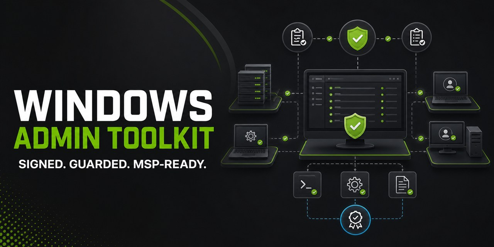

# Windows Admin Toolkit

<p align="center">
  
</p>

Signed, portable Windows administration for help desks, MSPs, and RMM automation. Twenty guarded workflows run from one PowerShell script across Windows PowerShell 5.1 and PowerShell 7.x.

[](https://github.com/fusiontechstrategies/Windows-Admin-Toolkit/actions/workflows/ci.yml)
[](https://github.com/fusiontechstrategies/Windows-Admin-Toolkit/releases/latest)
[](https://learn.microsoft.com/powershell/)
[](LICENSE)

Windows Admin Toolkit gives technicians an interactive console and gives automation systems stable actions, JSON results, audit evidence, policy boundaries, and useful exit codes. Start with the signed standalone release, evaluate it against synthetic data or a read-only lab, and move to authorized endpoints only after reviewing the security model.

[Install the signed release](#install-and-verify-the-signed-release) | [Preview sanitized output](examples/demo/README.md) | [Use it with RMM](examples/automation/README.md#read-only-rmm-execution) | [Review the security model](SECURITY.md)

## Why administrators use it

- One portable application file: `WindowsAdminToolkit.ps1`
- Compatible with Windows PowerShell 5.1 and PowerShell 7.x
- Secure WinRM transport by default
- Optional, tightly validated Microsoft Sysinternals PsExec fallback
- Bounded concurrency, timeouts, normalized failures, and read-only retries
- Exact confirmation phrases and `ShouldProcess` protection for changes
- Stable named actions, JSON envelopes, and exit codes for RMM, scheduled-task, and CI use
- Optional least-privilege policy profiles with explicit machine-readable decisions
- Capability preflight that checks action readiness without executing the requested action
- Opt-in JSON Lines and Windows Event Log auditing with stable target IDs and tamper-evident summaries
- Reviewable change plans, separate approvals, atomic checkpoints, and safe resume semantics
- Release tooling for optional Authenticode signing, SHA-256 manifests, and SPDX 2.3 SBOMs
- CSV, JSON, and self-contained HTML reporting
- No automatic firewall, WinRM, TrustedHosts, or execution-policy changes

## Twenty built-in workflows

| Area | Workflows |
| --- | --- |
| System visibility | System information, disk space, hardware, network configuration, logged-on users, running processes, installed software, Windows license status |
| Maintenance | Windows updates, scheduled reboot, pending reboot detection, service management, process termination, temporary-file cleanup, scheduled tasks |
| Security and diagnostics | Firewall status, event log queries, registry reads |
| Expert execution | Custom CMD commands and custom PowerShell code with explicit unsandboxed-execution warnings |

## Security by design

Windows Admin Toolkit treats remote administration as a privileged security boundary.

- WinRM is the default remote transport and supports `Default`, `Kerberos`, or `Negotiate` authentication.
- PsExec never receives an alternate password from this tool. It uses the current Windows identity, preventing plaintext password exposure in process arguments.
- PsExec must be Microsoft-signed, identify as Sysinternals PsExec, and be version 2.43 or newer.
- Remote actions and arguments use encoded, typed data envelopes instead of constructed command strings.
- State-changing actions are never retried automatically.
- Destructive and unsandboxed actions require an exact confirmation phrase in addition to PowerShell approval.
- Core Windows processes, including `lsass`, `services`, and `svchost`, are blocked from process termination.
- Temporary-file cleanup never touches Windows Prefetch, ignores reparse points, uses literal paths, and enforces a file-count ceiling.
- CSV exports neutralize spreadsheet formulas. HTML exports encode values. File exports are atomic and never overwrite an existing report.
- Logs record action summaries, not credentials, custom code, or custom-command output.
- Optional policies can only narrow actions, transports, target modes, targets, runtime limits, and supported action inputs.
- Audit records exclude credentials, custom source text, and raw action output; configured sink failures are explicit.
- Approved plans bind actions, inputs, ordered targets, transports, policies, and safety settings; completed or ambiguous state changes are never repeated automatically.

Read [SECURITY.md](SECURITY.md) and [RESPONSIBLE_USE.md](RESPONSIBLE_USE.md) before operating the toolkit in a production environment.

## Requirements

- A supported Windows client or Windows Server operating system
- Windows PowerShell 5.1 or PowerShell 7.x
- Administrator rights for actions that require elevation
- WinRM connectivity for default remote administration
- Optional: Microsoft Sysinternals PsExec 2.43 or newer for the fallback transport

The toolkit does not enable remote-management services or weaken security settings on your behalf.

## Install and verify the signed release

This copy-pasteable current-user install downloads the standalone asset from the latest GitHub release, requires a valid Windows Authenticode trust result, pins the complete approved signer identity, and only then installs it. It validates a unique same-directory candidate before an atomic move or replacement, and restores an existing installation if post-promotion verification fails. The installer preserves the machine execution policy; the effective policy and application-control rules must permit trusted signed scripts.

```powershell
$installDirectory = Join-Path $env:LOCALAPPDATA 'Programs\WindowsAdminToolkit'
$installedScript = Join-Path $installDirectory 'WindowsAdminToolkit.ps1'
$stagedScript = Join-Path ([IO.Path]::GetTempPath()) ("WindowsAdminToolkit-$([guid]::NewGuid().ToString('N')).ps1")

function Test-WatReleaseSignature {
    [CmdletBinding()]
    param(
        [Parameter(Mandatory = $true)]
        [string]$LiteralPath
    )

    $approvedSigners = @(
        [pscustomobject]@{
            Subject = 'CN="Fusion Technology Strategies, Inc.", O="Fusion Technology Strategies, Inc.", L=Ormond Beach, S=Florida, C=US, SERIALNUMBER=P15000091612, OID.2.5.4.15=Private Organization, OID.1.3.6.1.4.1.311.60.2.1.2=Florida, OID.1.3.6.1.4.1.311.60.2.1.3=US'
            Thumbprint = '44BB10D1C4ACB6B8A043BA136AE5442BEFD47131'
            PublicKeySha256 = '9ABCB20E3D546C2F2D0973AA98DC6E503387E88462EC9F9E5FD5DC5047A65275'
        }
    )

    $signature = Get-AuthenticodeSignature -LiteralPath $LiteralPath
    if ($signature.Status -ne 'Valid' -or -not $signature.SignerCertificate) {
        throw "Authenticode verification failed: $($signature.StatusMessage)"
    }

    $certificate = $signature.SignerCertificate
    $sha256 = [Security.Cryptography.SHA256]::Create()
    try {
        $publicKeySha256 = ([BitConverter]::ToString($sha256.ComputeHash($certificate.GetPublicKey())) -replace '-', '')
    }
    finally {
        $sha256.Dispose()
    }

    $matchingSigners = @(
        $approvedSigners | Where-Object {
            $_.Subject -ceq $certificate.Subject -and
            $_.Thumbprint -ceq $certificate.Thumbprint -and
            $_.PublicKeySha256 -ceq $publicKeySha256
        }
    )
    if ($matchingSigners.Count -ne 1) {
        throw "The signer certificate is valid but is not an approved release identity. Subject: $($certificate.Subject); thumbprint: $($certificate.Thumbprint); public-key SHA-256: $publicKeySha256"
    }
    if (-not $signature.TimeStamperCertificate) {
        throw 'The Authenticode signature does not contain a timestamp certificate.'
    }

    return $signature
}

function Install-WatVerifiedScript {
    [CmdletBinding()]
    param(
        [Parameter(Mandatory = $true)]
        [string]$SourcePath,

        [Parameter(Mandatory = $true)]
        [string]$DestinationPath,

        [Parameter(Mandatory = $true)]
        [string]$ExpectedSha256
    )

    $sourceFullPath = [IO.Path]::GetFullPath($SourcePath)
    $destinationFullPath = [IO.Path]::GetFullPath($DestinationPath)
    $normalizedExpectedHash = $ExpectedSha256.ToUpperInvariant()
    if ($normalizedExpectedHash -cnotmatch '^[0-9A-F]{64}$') {
        throw 'The expected SHA-256 value is not canonical.'
    }

    $validatePayload = {
        param([string]$LiteralPath)

        if (-not [IO.File]::Exists($LiteralPath)) {
            throw "The file to validate does not exist: $LiteralPath"
        }
        $actualHash = (Get-FileHash -LiteralPath $LiteralPath -Algorithm SHA256 -ErrorAction Stop).Hash
        if ($actualHash -cne $normalizedExpectedHash) {
            throw "SHA-256 mismatch. Expected $normalizedExpectedHash; received $actualHash."
        }
        [void](Test-WatReleaseSignature -LiteralPath $LiteralPath)
    }

    & $validatePayload $sourceFullPath

    $destinationDirectory = [IO.Path]::GetDirectoryName($destinationFullPath)
    if ([string]::IsNullOrWhiteSpace($destinationDirectory)) {
        throw 'The installation path has no parent directory.'
    }
    [void](New-Item -ItemType Directory -Path $destinationDirectory -Force -ErrorAction Stop)

    $operationId = [guid]::NewGuid().ToString('N')
    $candidatePath = Join-Path $destinationDirectory ".WindowsAdminToolkit-$operationId.candidate.ps1"
    $rollbackPath = Join-Path $destinationDirectory ".WindowsAdminToolkit-$operationId.rollback.ps1"

    try {
        [IO.File]::Copy($sourceFullPath, $candidatePath, $false)
        Unblock-File -LiteralPath $candidatePath -ErrorAction Stop
        & $validatePayload $candidatePath

        if ([IO.File]::Exists($destinationFullPath)) {
            try {
                [IO.File]::Replace($candidatePath, $destinationFullPath, $rollbackPath)
            }
            catch {
                if ([IO.File]::Exists($rollbackPath)) {
                    throw "Atomic replacement failed. The recovery copy remains at '$rollbackPath'. $($_.Exception.Message)"
                }
                throw
            }

            try {
                & $validatePayload $destinationFullPath
            }
            catch {
                $verificationError = $_
                try {
                    if (-not [IO.File]::Exists($rollbackPath)) {
                        throw 'The rollback copy is missing.'
                    }
                    if ([IO.File]::Exists($destinationFullPath)) {
                        [IO.File]::Replace($rollbackPath, $destinationFullPath, $candidatePath)
                    }
                    else {
                        [IO.File]::Move($rollbackPath, $destinationFullPath)
                    }
                }
                catch {
                    throw "The promoted file failed verification and automatic rollback failed. The recovery copy, if available, remains at '$rollbackPath'. Verification error: $($verificationError.Exception.Message) Rollback error: $($_.Exception.Message)"
                }
                throw $verificationError
            }

            if ([IO.File]::Exists($rollbackPath)) {
                [IO.File]::Delete($rollbackPath)
            }
        }
        else {
            [IO.File]::Move($candidatePath, $destinationFullPath)
            try {
                & $validatePayload $destinationFullPath
            }
            catch {
                $verificationError = $_
                try {
                    [IO.File]::Move($destinationFullPath, $candidatePath)
                }
                catch {
                    throw "The first installation failed verification and could not be removed safely. Verification error: $($verificationError.Exception.Message) Cleanup error: $($_.Exception.Message)"
                }
                throw $verificationError
            }
        }
    }
    finally {
        if ([IO.File]::Exists($candidatePath)) {
            [IO.File]::Delete($candidatePath)
        }
    }
}

try {
    Invoke-WebRequest `
        -Uri 'https://github.com/fusiontechstrategies/Windows-Admin-Toolkit/releases/latest/download/WindowsAdminToolkit.ps1' `
        -UseBasicParsing `
        -OutFile $stagedScript

    $expectedHash = (Get-FileHash -LiteralPath $stagedScript -Algorithm SHA256 -ErrorAction Stop).Hash
    [void](Install-WatVerifiedScript -SourcePath $stagedScript -DestinationPath $installedScript -ExpectedSha256 $expectedHash)
}
finally {
    if ([IO.File]::Exists($stagedScript)) { [IO.File]::Delete($stagedScript) }
}

& $installedScript -Automation -ListActions -JsonOutputPath -
```

For SHA-256 manifest verification, offline deployment, update procedures, and RMM staging guidance, use the complete [installation and trust guide](INSTALL.md). Version 3.0.1 is also available as a [complete signed ZIP](https://github.com/fusiontechstrategies/Windows-Admin-Toolkit/releases/tag/v3.0.1). GitHub-generated source archives and repository clones are reviewable source, not signed release assets.

## Five-minute no-change evaluation

Download and open the [sanitized HTML report](examples/demo/system-info-sample.html) or inspect the matching [JSON result](examples/demo/system-info-sample.json) without contacting a system. Then use `-ListActions` or a capability `-Preflight` in an isolated lab; neither operation executes the requested administration action. The [demo guide](examples/demo/README.md) walks through the sequence and marks the boundary before any live endpoint use.

## Common launch options

```powershell
# Default secure WinRM transport
.\WindowsAdminToolkit.ps1

# WinRM over HTTPS
.\WindowsAdminToolkit.ps1 -Transport WinRM -UseSsl

# Kerberos authentication with four concurrent remote jobs
.\WindowsAdminToolkit.ps1 -Authentication Kerberos -MaxConcurrentJobs 4

# Optional PsExec fallback under the current Windows identity
.\WindowsAdminToolkit.ps1 -Transport PsExec -PsExecPath C:\Tools\PsExec64.exe

# Preview state-changing actions without applying them
.\WindowsAdminToolkit.ps1 -WhatIf

# Noninteractive local inventory with clean JSON on stdout
.\WindowsAdminToolkit.ps1 -Automation -Action SystemInfo -Local -JsonOutputPath -

# Validate policy and capability readiness without running the requested action
.\WindowsAdminToolkit.ps1 -Automation -Action SystemInfo -Local -PolicyPath .\examples\policies\read-only-local.json -Preflight -JsonOutputPath -

# Create a new per-run JSON Lines audit alongside the JSON result
.\WindowsAdminToolkit.ps1 -Automation -Action SystemInfo -Local -AuditPath C:\Audit\wat-system-info.jsonl -JsonOutputPath C:\Results\wat-system-info.json

# Create a reviewable plan without executing its action
.\WindowsAdminToolkit.ps1 -Automation -PlanOperation Create -PlanPath C:\ChangePlans\system-info-pending.watplan.json -Action SystemInfo -Local -JsonOutputPath -
```

| Parameter | Default | Purpose |
| --- | --- | --- |
| `Transport` | `WinRM` | Selects `WinRM` or the optional `PsExec` fallback |
| `PsExecPath` | `PsExec64.exe` | Locates a Microsoft-signed PsExec executable |
| `WinRmIdentity` (`Credential` alias) | Current identity | Supplies an optional in-memory `PSCredential` for WinRM only |
| `MaxConcurrentJobs` | `8` | Limits simultaneous remote targets from 1 through 32 |
| `RetryCount` | `1` | Retries read-only remote actions only |
| `RetryDelaySeconds` | `3` | Sets the delay between read-only retries |
| `OperationTimeoutMinutes` | `30` | Limits each remote operation batch |
| `ConnectivityTimeoutSeconds` | `5` | Limits each preflight TCP check |
| `LogFile` | User-local log folder | Selects a specific log path |
| `UseSsl` | Off | Uses WinRM HTTPS on port 5986 |
| `Authentication` | `Default` | Selects `Default`, `Kerberos`, or `Negotiate` |
| `Quiet` | Off | Suppresses routine log messages |
| `SkipConnectivityCheck` | Off | Skips only the preflight port check |
| `PolicyPath` | None | Applies a strict versioned least-privilege profile in automation or interactive mode |
| `Preflight` | Off | In automation mode, checks requested-action capability without executing it |
| `AuditPath` | None | In automation mode, creates one new bounded JSON Lines audit file for the run |
| `AuditEventLog` | Off | Forwards bounded audit records through an already-registered Windows Event Log source |
| `AuditEventSource` | `WindowsAdminToolkit` | Selects the pre-registered source; valid only with `AuditEventLog` |
| `PlanOperation` | None | Selects controlled orchestration `Create`, `Approve`, `Execute`, or `Resume` |
| `PlanPath` | None | Selects a pending or approved `.watplan.json` artifact for the requested operation |
| `CheckpointPath` | None | Selects the `.watcheckpoint.json` lifecycle evidence for `Execute` or `Resume` |

Automation mode accepts `WinRmIdentity` (or its backward-compatible `Credential` alias) only as an in-memory `PSCredential` object from a calling PowerShell session. It rejects username strings instead of allowing native parameter binding to open credential UI. Scheduled tasks and RMM jobs should run under their authorized Windows identity or invoke the toolkit from a wrapper that already holds an approved `PSCredential`; never place passwords in command text.

## Automation, policy, audit, and controlled orchestration

Version 3.0.1 preserves the fail-closed automation, least-privilege policy, enterprise audit interfaces, and controlled orchestration introduced in 3.0.0. Direct automation runs one stable named action without menus or prompts and uses the same action implementations as the interactive menu.

```powershell
# Enumerate all stable action IDs and input requirements
.\WindowsAdminToolkit.ps1 -Automation -ListActions -JsonOutputPath -

# Query one remote target over WinRM and create a new JSON result
.\WindowsAdminToolkit.ps1 `
  -Automation `
  -Action DiskSpace `
  -ComputerName server01.example.com `
  -JsonOutputPath C:\Ops\Results\server01-disk.json

# Preview a state-changing action without contacting the target
.\WindowsAdminToolkit.ps1 `
  -Automation `
  -Action ScheduleReboot `
  -ComputerName server01.example.com `
  -RebootDelaySeconds 300 `
  -WhatIf `
  -JsonOutputPath -

# Enumerate action decisions under a validated policy
.\WindowsAdminToolkit.ps1 `
  -Automation `
  -ListActions `
  -PolicyPath .\examples\policies\read-only-local.json `
  -JsonOutputPath -

# Check a remote action's dependencies without executing that action
.\WindowsAdminToolkit.ps1 `
  -Automation `
  -Action EventLogQuery `
  -ComputerName server01.example.com `
  -EventLogName System `
  -EntryCount 50 `
  -PolicyPath .\examples\policies\helpdesk-winrm.json `
  -Preflight `
  -JsonOutputPath -

# Create a per-run JSON Lines audit for SIEM, RMM, or ticket ingestion
.\WindowsAdminToolkit.ps1 `
  -Automation `
  -Action SystemInfo `
  -Local `
  -AuditPath C:\Audit\wat-system-info-20260822.jsonl `
  -JsonOutputPath C:\Results\wat-system-info-20260822.json
```

Automation requires exactly one target source and rejects missing, conflicting, or action-incompatible inputs before target work. Actual state changes require the action's exact `-ConfirmationText`; `-WhatIf` returns a successful preview. Result schema version 1.2 and exit codes 0, 1, 2, 3, 4, 5, and 10 are documented in [AUTOMATION.md](AUTOMATION.md).

Policy schema version 1.0 uses explicit action, transport, target-mode, and target allow lists. Optional deny lists, runtime caps, and action-input constraints can only make built-in behavior narrower. Malformed profiles return validation exit code 2; valid policy denials return authorization exit code 3. The full precedence, target-pattern, decision, capability, and JEA contract is in [POLICY.md](POLICY.md).

Audit schema version 1.0 records run, request, policy, target, failure, and summary lifecycle events without raw action data. Each run has a UUID; each validated target has a deterministic cross-run ID; and the authoritative summary contains a documented SHA-256 canonical hash. Auditing is opt-in, never creates Event Log configuration, never overwrites a file, and converts a configured sink failure into a visible non-success result. See [AUDITING.md](AUDITING.md). Copy-pasteable RMM, scheduled-task, WinRM, target-list, policy, preflight, audit, and CI examples are in [examples/automation/README.md](examples/automation/README.md).

Controlled orchestration separates plan creation, exact-hash approval, execution, and resume. Plan schema 1.0 freezes the validated action, inputs, ordered targets, transport, policy snapshot, current-identity mode, and safety settings. Checkpoint schema 1.0 records `Pending`, `InProgress`, `Completed`, `Failed`, `TimedOut`, `Skipped`, and `Unknown` states with a one-attempt ceiling. Resume runs only `Pending` targets; an interrupted `InProgress` target becomes `Unknown` and is not repeated. See [ORCHESTRATION.md](ORCHESTRATION.md) and the synthetic examples in [examples/orchestration](examples/orchestration).

## Remote target lists

Copy [computers_example.txt](computers_example.txt) and replace its synthetic examples with systems you are authorized to administer. Use one hostname, fully qualified domain name, or canonical IPv4 address per line. Blank lines and lines beginning with `#` are ignored.

```text
server01.example.com
workstation01.example.com
192.0.2.10
```

The toolkit requires valid UTF-8 target lists, validates every target, reports invalid line numbers, removes duplicates case-insensitively, and caps imported lists at 1 MiB and 500 unique systems.

## Reports and logs

After an action, results can be exported to:

- CSV for spreadsheet analysis
- JSON for structured processing
- HTML for a self-contained browser report

Default logs are stored under:

```text
%LOCALAPPDATA%\WindowsAdminToolkit\Logs
```

Existing report files are never overwritten.

Opt-in enterprise audit files are separate per-run `.jsonl` artifacts. They are never appended to, overwritten, rotated, or deleted by the toolkit. See [AUDITING.md](AUDITING.md) for retention and failure behavior.

## Testing and validation

Release 2.0.0 completed 496 automated checks across four Windows and PowerShell environments on August 12, 2026. The final 3.0.0 controlled-orchestration suite contains 649 deterministic checks and passed on the native host under both Windows PowerShell 5.1 and PowerShell 7.6.4, for 1,298 completed host checks. The application and release builder also passed the preceding 647-check suite in clean Windows 10 Pro, Windows 11 Pro, Windows Server 2022, and Windows Server 2025 virtual machines before two certificate-validation regression checks were added.

| Environment | PowerShell | Result |
| --- | --- | --- |
| Native Windows 11 Pro, build 26200.9168 | Windows PowerShell 5.1.26100.9168 | 124 passed |
| Native Windows 11 Pro, build 26200.9168 | PowerShell 7.6.4 | 124 passed |
| Microsoft Windows Server Core 2025, Hyper-V-isolated container | Windows PowerShell 5.1.26100.33296 | 124 passed |
| Microsoft PowerShell Server Core 2022, Hyper-V-isolated container | PowerShell 7.5.0 | 124 passed |

The displayed container matrix is the historical 2.0.0 release record. Its tests mounted the repository read-only. The current native suite adds strict policy parsing, capability preflight, JSON Lines audit lifecycles, cross-run target IDs, canonical SHA-256 summary verification, strict plan and checkpoint parsing, hash-bound approvals, interruption recovery, no-repeat lifecycle semantics, and release-manifest/SBOM checks. PSScriptAnalyzer 1.25.0 reports zero findings under the committed settings. The automated suite makes no destructive system changes.

The prior release's container tags, digests, commands, and the exact current native validation record are in [TESTING.md](TESTING.md). Continuous integration repeats the dependency-free suite on Windows Server 2022 and Windows Server 2025 with both Windows PowerShell and PowerShell 7.

## Enterprise roadmap

The 2.1.0 automation interface, 2.2.0 policy boundary, 2.3.0 enterprise auditability, and 3.0.0 controlled orchestration capabilities were released together in version 3.0.0. The official release includes Authenticode-signed toolkit assets, a verified SHA-256 manifest, and an SPDX 2.3 SBOM. See [ROADMAP.md](ROADMAP.md) and [RELEASING.md](RELEASING.md).

## Contributing

Issues and pull requests are welcome. Start with [CONTRIBUTING.md](CONTRIBUTING.md), follow [CODE_OF_CONDUCT.md](CODE_OF_CONDUCT.md), and run both supported PowerShell editions before submitting code.

## License

Windows Admin Toolkit is available under the [MIT License](LICENSE).

Microsoft, Windows, PowerShell, Sysinternals, and PsExec are trademarks of their respective owners. PsExec is not included in this repository.
